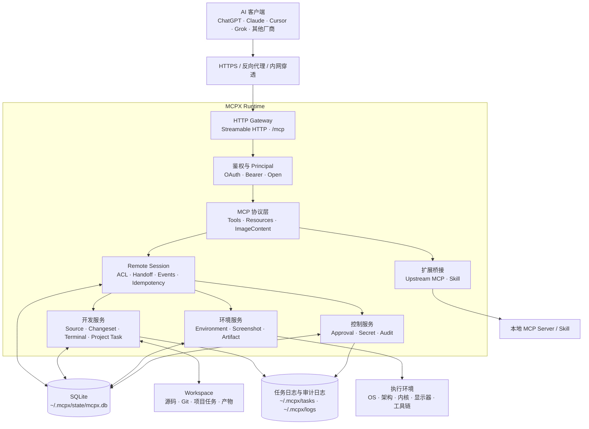

# MCPX

**连接 AI 与本地开发环境的 MCP Runtime。**

MCPX 是运行在开发环境中的 **MCP Runtime（网关）**。ChatGPT、Claude、Cursor、Grok 及其他支持 Streamable HTTP 的 MCP 客户端，可以通过统一工具面理解项目、查看 Unified Diff、修改源码、运行任务、采集环境信息，并调用本地 MCP 与 Skill。

开发状态保存在 SQLite Remote Session 中，不依赖某个 AI 厂商或单次 `Mcp-Session-Id`。不同客户端可以查询、授权接力并继续同一项开发工作。

**文档语言：** 中文（默认） · [点击阅读英文版](README.en.md)

---

## 它能做什么

| 能力                  | 说明                                                                      |
| --------------------- | ------------------------------------------------------------------------- |
| **Remote Session**    | SQLite 持久会话、ACL、一次性接力 Token，跨客户端与传输会话继续开发        |
| **Workspace**         | 多项目注册，创建 Remote Session 时显式绑定目标项目                        |
| **Terminal**          | 短命令 + 持久长任务，可列表、attach、分页读取日志、查看监听端口和停止任务 |
| **Source**            | 项目检查、源码列表 / 搜索 / 读取，读取结果携带 SHA-256                    |
| **Changeset**         | 草稿、Unified Diff、冲突检测、策略审批、事务应用、历史与回退              |
| **Workspace Changes** | Git 状态与 Diff，按 `mcpx` / `preexisting` / `external` 标记变更来源      |
| **Project Task**      | 从项目清单发现测试、构建、检查任务，持久执行并解析结构化诊断              |
| **Artifact**          | 注册测试报告、覆盖率、构建产物和日志，支持 Resource Link 与分页读取       |
| **Environment**       | OS、架构、内核、屏幕分辨率、容器、Shell、资源、文件系统与工具链快照       |
| **Screenshot**        | 全屏或任意坐标区域截图，支持 PNG/JPEG 与压缩档位                          |
| **MCP 代理**          | 不重复实现 GitHub/DB 等，配置后 `mcp_call` 转发                           |
| **Skill**             | 扫描 `SKILL.md` / `skill.yaml`，可执行或返回文档                          |
| **安全**              | OAuth / Bearer、Principal、Remote Session ACL、命令与文件策略、人工审批   |
| **审计**              | 关键调用写入本地 JSONL 日志                                               |

## 架构



架构中的两类 Session 职责不同：

| 标识                | 生命周期                              | 用途                                                             |
| ------------------- | ------------------------------------- | ---------------------------------------------------------------- |
| `Mcp-Session-Id`    | 临时，可在重连或切换客户端时变化      | Streamable HTTP 传输状态                                         |
| `remote_session_id` | SQLite 持久化，可跨连接和进程重启查询 | Workspace、成员权限、Changeset、任务、审批、快照和产物的业务主键 |

源码修改默认采用 Diff First 流程：读取源码与 SHA-256 → 准备 Changeset → 展示 Unified Diff → 校验 revision 和策略 → 事务应用。工具结果内联返回（上限 `limits.max_result_bytes`，默认 256KB）：命令 stdout/stderr 直接内联，变更文件条目包含每文件 Diff 预览；完整 Unified Diff 保存在 Changeset 状态中，并可通过 `mcpx://remote-sessions/...` Resource Link 读取，不会写入 workspace。

---

## 快速开始

### 1. 安装

**从 Release 下载（推荐）**

到 [Releases](https://github.com/opentokenz/mcpx/releases) 下载对应平台的压缩包，解压得到 `mcpx-server`。

**或从源码编译**

```bash
git clone https://github.com/opentokenz/mcpx.git
cd mcpx
go build -o bin/mcpx-server ./cmd/mcpx-server
```

需要 **Go 1.26.1+**（开发环境以 `go.mod` 为准）。

### 2. 启动

```bash
./mcpx-server
# 或注册一个项目并启动
./mcpx-server --workspace /path/to/your/project
```

首次启动会在 **`~/.mcpx/`**（可用环境变量 `MCPX_HOME` 覆盖）自动生成：

| 路径                      | 作用                                                                   |
| ------------------------- | ---------------------------------------------------------------------- |
| `config.yaml`             | 全局配置（端口、鉴权、安全策略、workspaces…）                          |
| `.mcp.json`               | 上游 MCP 列表（默认可为空）                                            |
| `logs/`                   | 审计日志                                                               |
| `state/mcpx.db`           | Remote Session、Principal、Changeset、任务元数据、审批、快照和产物索引 |
| `tasks/`                  | 持久终端任务日志，文件权限为 `0600`                                    |
| `skills/`                 | 可选技能目录                                                           |
| `oauth-clients.json`      | 按需生成的 OAuth 动态客户端注册表                                      |
| `workspaces.example.yaml` | Workspace 配置示例                                                     |

默认监听：**`127.0.0.1:9090`**  
MCP 端点：

```text
http://127.0.0.1:9090/mcp
```

服务仅提供 Streamable HTTP 传输，不提供旧版 HTTP+SSE 兼容端点。

启动日志会打印已注册项目、发现的 Skill 与 MCP，方便确认环境。

```bash
./mcpx-server -version   # 查看版本
```

### 本机只读 Workspace 观测

服务端运行期间可在另一个终端打开指定 Workspace 的事件流：

```bash
./mcpx-server workspace demo
# 机器处理：
./mcpx-server workspace --format json --history 200 demo
```

观测命令只通过本机 Unix Socket 订阅事件，不启动第二个 HTTP 服务，也不会执行工具、命令或修改 Workspace。启动时先回放最近事件，随后由服务端事件推送实时展示；连接中断后按 sequence 自动补偿，不轮询 SQLite。按 `Ctrl-C` 正常退出。

text 模式使用终端 Agent 风格时间线：工具开始事件不单独输出，每个完成动作使用过去式 `• Ran`、`• Searched`、`• Read`、`• Edited`、`• Created` 等动词；命令和文件路径保留，结果压缩为一两行 `↳` 摘要，文件变更只显示少量 Diff 片段，其余以 `...` 表示。不会输出 `TOOL STARTED`、`TOOL COMPLETED`、JSON 参数、卡片、表格或状态栏；需要机器处理时使用 `--format json`：

````text
• Ran go test ./internal/auth
  ↳ 修改登录流程并运行相关测试
  ↳ 12 tests passed
• Edited internal/auth.go
  ↳ internal/auth.go (update) +1 -1
    -return legacyLogin()
    +return secureLogin()
    ...
````

搜索动作会显示可复现的等价命令和命中位置；`context_query` 本身由服务端源码索引执行，不会通过 Shell 再执行一次命令：

````text
• Listed workspaces
  ↳ Available workspaces: fyy (/Users/you/workspaces/fyy)
• Searched rg --glob "**/*.vue" "customer phone" fanyi-cloud-ui
  ↳ Source search returned 2 matches: fanyi-cloud-ui/src/views/erp/index.vue:81, fanyi-cloud-ui/src/views/erp/order.vue:24
• Read fanyi-cloud-ui/src/views/erp/order.vue
  ↳ Read 1 source item(s); 8555 bytes returned.
• Edited fanyi-cloud-ui/src/views/erp/order.vue
  ↳ fanyi-cloud-ui/src/views/erp/order.vue (update) +12 -4
````

`workspace` 子命令参数如下：

```bash
mcpx-server workspace [flags] <workspace name>
# -history int   回放最近事件数量，范围 1-200，默认 100
# -format text   终端风格输出（默认）
# -format json   一行一个事件，供脚本或日志系统消费
```

观测 text 输出中的 `rg` / `find` 是源码查询的等价展示，不代表服务端执行了 Shell 命令；文件路径是 Workspace 内的项目相对路径，Workspace 列表会同时显示注册根路径。

MCP 工具响应同样以 Markdown 文本作为模型和宿主的默认展示内容，完整 ARC 机器结果保存在响应 `_meta["mcpx.result"]`，不再放入会被宿主直接渲染为 JSON 卡片的 `structuredContent`。

常见结果的默认文本形式如下：

````markdown
Available workspaces:
- `fyy` — `/Users/you/workspaces/fyy` — ERP frontend

Source search returned 2 match(es).
- `fanyi-cloud-ui/src/views/erp/index.vue:81` — customer lookup
- `fanyi-cloud-ui/src/views/erp/order.vue:24` — selected customer

### `fanyi-cloud-ui/src/views/erp/order.vue` (lines 520-779)

```vue
<el-form-item label="联系人">
  <el-input v-model="dept.contactName" />
```
````

服务端不能控制客户端是否保留自己的“已调用工具”卡片；MCPX 控制的是工具返回的默认文本内容，确保模型和支持 Markdown 的宿主不需要解码 JSON 才能看到工作区、路径、搜索命中和代码片段。

模型在下一次工具调用的顶层 `progress_summary` 中补发上一次工具的可验证结果和下一步；如果任务完成、等待用户、被阻塞或暂时不再调用工具，应调用 `progress_report`，提交摘要、结果、状态和下一步。该字段记录的是可验证进度，不是隐藏思维链。

`progress_summary` 和 `progress_report.summary` 均限制为 512 字节，内容应是可验证事实，不应记录隐藏思维链。没有下一次工具调用时，使用 `progress_report`：

```json
{
  "intent": "汇报当前读取结果并等待用户决定下一步",
  "remote_session_id": "rs_example",
  "summary": "已读取 SupplierDetailForm.vue，确认截图中的证照字段均已有绑定",
  "result_summary": "文件读取成功，返回 827 行",
  "status": "waiting_for_user",
  "next_step": "等待用户确认是否继续修改布局",
  "related_tool": "file_read"
}
```

`status` 可取 `in_progress`、`completed`、`waiting_for_user`、`blocked`。工具调用仍必须提供顶层 `intent`；观测 text 模式不会把它作为 `intent:` 单独打印。

观测内容来自已持久化事件，包含脱敏和大小上限；超长 Diff、命令输出或二进制内容会明确标记截断，并保留 Resource URI。服务端未运行、Workspace 未注册或 Socket 不可访问时，命令会输出实际错误并返回非零状态码。

---

## 配置速览

### 全局：`~/.mcpx/config.yaml`

```yaml
server:
  host: 127.0.0.1
  port: 9090
  # 公网 / 反代 / frp 时如遇 Host 被拒，可设：
  # disable_localhost_protection: true
  # 需要从 X-Forwarded-Proto / X-Forwarded-Host 推导公网 URL 时启用：
  # trust_proxy_headers: true
  # 公网建议显式限制浏览器 Origin：
  # allowed_origins: ["https://your-ai-client.example"]

auth:
  # mode: open | bearer | oauth | dual
  # 空 mode：有 token 则按 bearer，否则 open
  mode: ""
  token: "" # 静态 Bearer（桌面客户端可手写 Header）
  oauth:
    password: "" # 网页授权口令；空则启动时生成并打印
    server_url: "" # 公网 origin，如 https://mcp.example.com （网页必配）
    token_ttl: 86400
    token_secret: "" # 可选；至少 32 字节密钥的十六进制编码（至少 64 个字符）

workspaces:
  - name: my-app
    path: /Users/you/code/my-app
    description: "示例业务项目"

discovery:
  instructions:
    # 可选；支持绝对路径或 ~/，仅允许在全局 config.yaml 中配置
    global_agents_path: ~/.agents/AGENTS.md
  skills:
    enabled: true
    dirs:
      - ~/.agents/skills
      - ~/.codex/skills
      - .skills
    # 可选附加目录；服务端统一从配置目录发现 Skill
    extra_dirs:
      - /Users/you/.local/share/mcpx/skills

security:
  commands:
    # 未命中 allow/confirm/deny 时的默认：allow | confirm | deny
    default: allow # 未命中规则时的默认决策；confirm 规则仍需 approval_manage
    allow:
      - ^ls\b
      - ^git status
    confirm:
      - ^git push
      - ^docker
    deny:
      - ^rm -rf /
  files:
    max_read_bytes: 1048576
    max_patch_files: 20
    max_patch_lines: 2000 # 单次 Changeset 允许的真实差异行数；大文件整体替换场景可按需调高
    deny:
      - ^\.git/
limits:
  max_result_bytes: 262144 # 工具结果内联上限（256KB），命令输出与 Diff 预览共用
```

也可用命令注册项目（会写回全局配置）：

```bash
./mcpx-server --workspace /Users/you/code/my-app
```

### 上游 MCP：`~/.mcpx/.mcp.json`

```json
{
  "mcpServers": {
    "github": {
      "type": "stdio",
      "command": "npx",
      "args": ["-y", "@modelcontextprotocol/server-github"],
      "env": {
        "GITHUB_TOKEN": "${GITHUB_TOKEN}"
      }
    }
  }
}
```

项目级可再放：`{项目}/.mcpx/.mcp.json`（同名覆盖全局）。

### 项目级：`{项目}/.mcpx.yaml`（可选）

```yaml
description: "覆盖全局里的项目描述"
security:
  commands:
    default: allow
```

HTTP Bearer / OAuth 鉴权是进程级配置，只在全局 `config.yaml` 中定义；
项目配置用于描述、命令策略、文件策略与能力开关，不覆盖全局身份凭证。

---

## 接入客户端

### 网页端聊天（主目标）

在支持 **Remote MCP / 自定义 Connector** 和 Streamable HTTP 的网页聊天中，填入公网地址即可。OAuth 客户端通常不需要手写 Header：

1. 用反代 / frp / 云主机把 **HTTPS** 指到 MCPX（本机可仍听 `127.0.0.1:9090`）。
2. 配置示例：

```yaml
server:
  disable_localhost_protection: true # Host 非 loopback 时通常需要
auth:
  mode: oauth # 或 dual（同时保留静态 token）
  oauth:
    password: "换成强口令"
    server_url: "https://你的公网域名或主机"
```

3. 启动 MCPX，确认日志里的 endpoint / oauth 信息。
4. 网页聊天添加 MCP URL：`https://你的公网/mcp`。
5. （ChatGPT 自定义客户端）复制回调 URL 后注册：

```bash
mcpx-server oauth-register 'https://chatgpt.com/connector/oauth/…'
# 或交互粘贴：
mcpx-server oauth-register
```

将打印的 `client_id` 填入 ChatGPT（密钥空、令牌认证 none）。6. 浏览器打开授权页，输入 **oauth.password**，回到会话后即可调工具。

相关发现端点（客户端自动使用）：

- `GET /.well-known/oauth-protected-resource`
- `GET /.well-known/oauth-authorization-server`
- `POST /mcp/oauth/register` · `GET|POST /mcp/oauth/authorize` · `POST /mcp/oauth/token`

> 未授权访问 `/mcp` 返回 **HTTP 401** 与 `WWW-Authenticate`（含 `resource_metadata`）。  
> 产品**不内置隧道服务**；公网入口自备即可。
> MCPX 不提供旧版 HTTP+SSE 的 `/sse`、`/message` 等兼容端点。

### Grok（桌面）

`~/.grok/config.toml`：

```toml
[mcp_servers.mcpx]
url = "http://127.0.0.1:9090/mcp"
enabled = true
tool_timeout_sec = 600

# 静态 Bearer（auth.mode=bearer 或 dual 且配置了 token）：
# [mcp_servers.mcpx.headers]
# Authorization = "Bearer ${MCPX_TOKEN}"
```

然后在 TUI：`/mcps` → 按 **`r`** 刷新，看到 **mcpx [ready]**。

> 建议：**新开一轮会话** 再开发，工具表才会挂上 `mcpx__*`。  
> 若 Grok 走远程 OAuth，与网页相同：配 `server_url` + `mode: oauth|dual`。

### Cursor / 其他 HTTP MCP 客户端

**静态 Bearer：**

```json
{
  "mcpServers": {
    "mcpx": {
      "url": "http://127.0.0.1:9090/mcp",
      "headers": {
        "Authorization": "Bearer YOUR_TOKEN"
      }
    }
  }
}
```

**OAuth：** 仅填 Remote URL（同网页），由客户端完成 DCR + 授权码 + PKCE。

仅支持 stdio 的客户端可用桥接，例如：

```bash
npx -y mcp-remote http://127.0.0.1:9090/mcp
```

### 探测是否正常（不要只靠裸 GET）

```bash
curl -sS -m 5 \
  -H 'Content-Type: application/json' \
  -H 'Accept: application/json, text/event-stream' \
  -d '{"jsonrpc":"2.0","id":1,"method":"initialize","params":{"protocolVersion":"2025-11-25","capabilities":{},"clientInfo":{"name":"curl","version":"0.1"}}}' \
  http://127.0.0.1:9090/mcp
```

看到 `"name":"mcpx"` 即表示握手成功。

---

## 工具一览

客户端里名称形如 **`mcpx__workspace_list`**（服务器名 + 双下划线 + 工具名）。

每个 MCP 工具调用都必须携带顶层 `intent`，用于说明本次请求的目标和预期结果；缺失或超过 512 字节会在业务 handler 执行前拒绝：

```json
{
  "intent": "读取登录流程，修改校验逻辑并运行相关测试",
  "progress_summary": "已选择登录模块，准备读取当前实现",
  "remote_session_id": "rs_…",
  "path": "internal/auth.go"
}
```

| 类别     | 工具                  | 用途                                                                                         |
| -------- | --------------------- | -------------------------------------------------------------------------------------------- |
| 高频开发 | `workspace_list`      | 查询已注册 Workspace。                                                                       |
| 高频开发 | `session_open`        | 一次创建或恢复 Remote Session，并返回初始化上下文。                                          |
| 高频开发 | `file_read`           | 读取单文件或 `items[]` 批量文件窗口，返回独立 SHA-256；修改前必须先读取当前内容。            |
| 高频开发 | `context_query`       | 通过 `query` / `search` / `list` 动作获取受预算限制的源码上下文。                            |
| 高频开发 | `change_execute`      | 一次完成普通修改的 Changeset、策略检查、原子 Apply 和可选验证。                              |
| 高频开发 | `command_execute`     | 执行命令或项目任务；10 秒内返回结果，超时转统一 Task；stdout/stderr 内联返回（上限 256KB）。 |
| 高频开发 | `progress_report`     | 工具后暂停、完成、等待用户或阻塞时，记录可验证进度、结果状态与下一步。                       |
| 领域管理 | `session_manage`      | `list`、`get`、`events`、`update`、`handoff`、`attach`、`close`。                            |
| 领域管理 | `change_manage`       | 仅用于 `prepare`、`diff`、`history`；Apply 和回滚统一通过 `change_execute`。                 |
| 领域管理 | `plan_manage`         | 创建与推进持久化开发 Plan（`create` / `get` / `start_task` / `complete_task` / `block_task` / `replan` / `deliver`），只管理计划状态与证据。 |
| 领域管理 | `task_manage`         | `attach`、`status`、`logs`、`list`、`stop`、`ports`、`diagnostics`、`stdin`。                |
| 领域管理 | `runtime_inspect`     | `capabilities`、`project`、`instructions`。                                                  |
| 领域管理 | `environment_inspect` | 查看环境并保存或比较快照。                                                                   |
| 领域管理 | `workspace_state`     | `changes`、`snapshot`、`diff`、`watch`。                                                     |
| 领域管理 | `extension_manage`    | 统一 `list`、`describe`、`call` Skills 和上游 MCP。                                          |
| 领域管理 | `artifact_manage`     | `list`、`read`、`register` Artifact。                                                        |
| 领域管理 | `approval_manage`     | `list`、`approve`、`deny` 高风险操作。                                                       |
| 特殊能力 | `screenshot_capture`  | 截取显示器或区域。                                                                           |
| 特殊能力 | `secrets_provide`     | 提供仅进程内可用的 Secret 引用。                                                             |

`tools/list` 只暴露以上 **19** 个工具。低频操作必须通过其领域工具的 `action` 分支调用；文件读取和普通修改分别统一使用 `file_read`、`change_execute`。所有直接文件修改都必须经过 `change_execute`，不能通过 `command_execute` 或 `change_manage` 绕过。

### 推荐开发流程

1. Workspace 已知时直接调用 `session_open`；未知时先调用 `workspace_list`。
2. `session_open` 返回根级 `AGENTS.md` 元数据、项目摘要、任务、Skills、上游 MCP、Changeset、Approval、Artifact、`agent_guidance` 与独立 revision。需要正文时显式设置 `include_instructions_content: true`；需要项目任务时设置 `include_project_tasks: true`；需要上游工具 Schema 时设置 `include_upstream_tools: true`。Skills 是否发现及扫描哪些目录完全由服务端 `discovery.skills.enabled`、`discovery.skills.dirs` 和 `extra_dirs` 配置控制，不使用请求级 `include_skills` 参数。
3. 用 `context_query(action="query" | "search" | "list")` 定位文件；已知文件用 `file_read(items=[])` 批量读取。
4. 用 `change_execute` 进行所有文件修改；草稿、审阅和历史使用 `change_manage`，Apply 或回滚使用 `change_execute` 的 `changeset_id` / `revert_changeset_id`。
5. 用 `command_execute` 运行测试或命令；超过 10 秒时按响应中的 `task_manage(action="attach")` 继续。
6. 用 `workspace_state(action="changes")` 检查最终变更；跨客户端接力使用 `session_manage(action="handoff" | "attach")`。

大型 Unified Diff、任务日志和已注册 Artifact 通过 `mcpx://remote-sessions/...` Resource 读取。命令输出与 Diff 预览默认内联（上限 256KB），代码变更 UI 和工具文本按文件展示具体增删内容，超过时返回截断提示与 Resource Link；完整大内容不会在多个响应字段中镜像。

### 机器可读能力发现

MCP 标准 `tools/list` 是工具名称、描述、参数 JSON Schema 和 Annotation 的唯一权威来源。调用 `runtime_inspect(action="capabilities")` 可取得 Workspace / Remote Session 的运行时状态与：

- `tool_schema_revision`：由实际注册工具的名称、描述、Schema 与 Annotation 计算；新建 Session 不会改变它。
- `capability_manifest_revision`、`guidance_revision`、`instruction_revision`、`skill_revision`、`mcp_revision`、`session_capability_revision`：可分别判断哪些能力需要刷新。
- `tools`：每个公开工具的领域、状态、角色限制和是否要求 `remote_session_id`。
- `agent_guidance`、`instructions`、Skills、上游 MCP、Resource URI 模板和推荐调用链。`agent_guidance` 默认返回，不受指令正文或上游发现开关影响；其中 `response_contract` 要求模型在重要操作前说明目的、完成后报告真实结果、文件变更、验证证据与风险，不得无证据宣称完成。

客户端首次连接应调用 `tools/list`；绑定 Workspace 或 Remote Session 后调用 `runtime_inspect(action="capabilities")`。`session_open` 接受 `known_revisions`，未变化的 Skills、上游 MCP、指令和 Session capability 会在响应中标为 `omitted`，避免重复传输。

需要查看或调用扩展时使用 `extension_manage`：`action="list"` 返回 Skills 和上游 MCP；`action="describe"` 可按需发现某个 MCP Server 的完整工具 Schema；`action="call"` 调用 Skill 或上游工具。可执行 Skill 可以在 `skill.yaml` 声明 JSON Schema 风格的 `arguments_schema`。

### AGENTS.md 指令

全局指令路径通过全局 `config.yaml` 的 `discovery.instructions.global_agents_path` 配置，支持绝对路径与 `~/`。初始化顺序为全局指令 → Workspace 根 `AGENTS.md` → 目标路径祖先目录中的嵌套 `AGENTS.md`。项目 `.mcpx.yaml` 不能覆盖全局指令路径。

`session_open` 默认返回全局与根级指令的元数据；设置 `include_instructions_content: true` 后才内联受预算限制的正文。路径级解析使用 `runtime_inspect(action="instructions", anchor_path="...")`。每份文档均返回 scope、priority、SHA-256 与字节数，不暴露宿主机绝对路径。软链接、非常规文件和超过 `security.files.max_read_bytes` 的文档不会被暴露。

### 补丁式源码修改

对已有文件，先用 `file_read` 获取目标片段及其 `sha256`，再调用 `change_execute`。`operations` 使用 `base_sha256` 和 `patch`（Unified Diff hunk），由服务端校验版本、上下文和文件策略，创建 Changeset 后原子 Apply；高风险操作会返回 `approval_manage(action="approve")` 的可执行 `next_action`。草稿、Diff、历史等低频生命周期操作使用 `change_manage`；已准备 Changeset 的 Apply 和回滚仍统一通过 `change_execute`。`change_execute` 三种模式互斥：`operations`（新建并应用）、`changeset_id + expected_digest`（应用草稿）、`revert_changeset_id`（回滚已应用变更）。

```json
{
  "remote_session_id": "rs_example",
  "summary": "更新页面标题",
  "operations": [
    {
      "operation": "update",
      "path": "src/App.vue",
      "base_sha256": "sha256:...",
      "patch": "@@ -8,1 +8,1 @@\n-  <h1>旧标题</h1>\n+  <h1>新标题</h1>"
    }
  ]
}
```

`create` 使用完整 `content`；`update` 仍接受完整 `content` 作为无法生成补丁时的兜底。`rename` 和 `delete` 只需提交路径与 `base_sha256`。`expected_sha256` 保留为 `base_sha256` 的兼容别名。

除 `patch` 外，`operations` 还支持按内容精确编辑的快捷操作，均要求 `base_sha256`（当前 revision）：

| 操作                             | 参数                                    | 用途                                                         |
| -------------------------------- | --------------------------------------- | ------------------------------------------------------------ |
| `replace_exact`                  | `match` + `content`                     | 精确替换唯一出现的一段文本                                   |
| `insert_before` / `insert_after` | `match` + `content`                     | 在某段文本前/后插入（插入完整行时 `content` 需自带结尾换行） |
| `delete_exact`                   | `match`                                 | 删除唯一出现的一段文本                                       |
| `replace_range`                  | `range_start` + `range_end` + `content` | 按 1 起始行号替换区间，适合大文件局部修改                    |

行尾兼容：提交的 `content` / `patch` / `match` 会自动归一化到目标文件的换行符（CRLF/LF），小改动不会翻转整个文件的行尾风格。`security.files.max_patch_lines` 按**真实差异行数**计算（公共前缀/后缀之外的中间段），大文件内的小改动不会被误判超限；全量替换则按整体行数计，超限会返回 `PATCH_TOO_LARGE` 及拆分建议。完整 Diff 预览内联返回，每个文件条目同时提供受限 Diff 预览，全文通过 Changeset Resource 读取，不会写入 workspace。

截图工具使用 `environment_inspect` 返回的显示器索引。`fullscreen` 截取完整显示器；`region` 使用全局 `x / y / width / height` 坐标。`compression` 支持 `none`、`balanced` 和 `small`。截图只通过 MCP 响应返回，不默认写入项目或 SQLite。

---

## 安全与数据边界

- **鉴权模式**：`open` 只建议本机使用；`bearer` 适合静态客户端；`oauth` 适合网页端；`dual` 同时接受 OAuth 和静态 Bearer。
- **身份归属**：OAuth 使用校验后的 `issuer + subject`，静态 Bearer 使用 Token 摘要，均映射为稳定 Principal；厂商名和 `clientInfo` 不作为授权身份。
- **Remote Session ACL**：成员角色包括 `viewer`、`editor`、`approver` 和 `owner`。一次性 Handoff Token 在 SQLite 中只保存 SHA-256。
- **命令与文件策略**：`security.commands` 和 `security.files` 决定允许、拒绝或要求确认的操作。Changeset 应用前还会校验文件 revision 与策略。
- **Secret**：`secrets_provide` 的明文值仅在进程内短期缓存，不写入 SQLite、日志或 Workspace；不要把密码直接拼入命令字符串。
- **持久文件**：`state/` 目录权限为 `0700`，SQLite、任务日志和凭证文件使用 `0600`。审计日志不记录 Secret 明文或截图数据。
- **截图**：截图使用权限为 `0600` 的临时文件完成编码，响应后立即清理；默认不写入 Workspace 或 SQLite。
- **公网暴露**：禁止在公网使用 `open`；配置 `oauth.server_url`、强口令和 HTTPS。只有可信反向代理前才启用 `trust_proxy_headers`。
- **OAuth 重启行为**：动态客户端注册表持久化在 `~/.mcpx/oauth-clients.json`；`token_secret` 未配置时首启生成并持久化到 `~/.mcpx/oauth-token-secret`（0600），重启后 access token 依然有效；删除该密钥文件才会使已有 token 失效。
- **会话边界**：开发状态显式绑定 `remote_session_id`；`Mcp-Session-Id` 只用于传输层，可随客户端重连而变化。

## 当前限制

- 只支持 Streamable HTTP `/mcp`，不兼容旧版 HTTP+SSE 客户端。
- SQLite schema 由 `schema_migrations` 管理，升级通常自动迁移；破坏性迁移会在发版说明中标注，届时按说明处理 `~/.mcpx/state/mcpx.db`。
- MCPX 进程重启后，SQLite 中的 Remote Session、Changeset 和任务历史仍可查询；原先运行中的子进程暂不能重新接管，会标记为 `interrupted`。
- 状态、任务日志、Snapshot 和 Artifact 尚未提供自动保留与归档后台任务。
- 截图需要桌面会话与系统录屏权限。macOS 在「系统设置 → 隐私与安全性 → 屏幕录制」中勾选的是**启动 mcpx-server 的终端应用**（Terminal / iTerm / VS Code 集成终端等），不是二进制路径；更换终端启动需重新授权，勾选后通常要重启终端或服务器才生效。Linux 需要可用的 `grim`、`scrot` 或 ImageMagick `import`。

## Future

- **Presentation**：继续完善宿主能力协商，让客户端可以按自身能力选择 `diff`、`table`、`tree`、`diagram` 等视图，并始终保留安全的文本降级路径。
- **ARC**：推进结果类型与 JSON Schema 的兼容演进，补充版本协商、错误恢复和跨客户端一致的动作描述。
- **大结果交付**：进一步统一 Diff、日志、搜索结果和 Artifact 的 Resource Link 分页与流式读取，减少内联响应体积。
- **可观测性**：完善 trace、耗时和结果分类指标，帮助定位客户端渲染、审批链路和任务执行问题。

---

## 常用参数与环境变量

| 参数 / 环境变量                    | 说明                               |
| ---------------------------------- | ---------------------------------- |
| `--workspace <path>`               | 注册项目并写入全局配置             |
| `--addr host:port`                 | 覆盖监听地址                       |
| `--log-level` / `MCPX_LOG_LEVEL`   | debug / info / warn / error        |
| `--log-format` / `MCPX_LOG_FORMAT` | text / json                        |
| `--version`                        | 打印版本                           |
| `MCPX_HOME`                        | 配置与日志根目录（默认 `~/.mcpx`） |

---

## 从源码开发

完整的分支、PR、分支保护和发布约定见 [CONTRIBUTING.md](CONTRIBUTING.md)。`main` 是受保护分支，开发变更必须通过 PR 合并，禁止直接推送和 force push。

```bash
go test ./...
go test -race ./...
go vet ./...
go build -o bin/mcpx-server ./cmd/mcpx-server
```

发布：变更先通过 PR 合并到 `main`，再从已验证的 `main` 提交创建版本标签，触发 GitHub Actions + GoReleaser（多平台二进制，**不打包**文档目录）：

```bash
git tag v0.1.0
git push origin v0.1.0
```

---

## 目录结构（源码）

```text
mcpx/
  cmd/mcpx-server/     # 入口
  internal/
    server/            # Streamable HTTP Gateway、工具和 Resource 注册
    auth/              # Bearer / OAuth 凭证校验与 Principal
    oauth/             # DCR、PKCE、授权页与 access token
    config/            # 配置加载与引导
    state/             # SQLite、迁移与权限设置
    remotesession/     # 持久会话、ACL、Handoff 与事件
    source/            # 源码导航与哈希读取
    changeset/         # Diff、事务应用与回退
    workspacechanges/  # Git 变更与来源归因
    terminal/          # 命令、持久任务、日志与端口
    projecttask/       # 项目任务发现与诊断解析
    file/              # 文件策略、快照与 Changeset 底层文件操作
    filesnapshot/      # Workspace 持久快照
    environment/       # 环境探测、快照与漂移
    screenshot/        # 跨平台截图、显示器探测与压缩
    artifact/          # 开发产物索引与读取
    approval/          # 人工审批元数据
    secrets/           # Secret 请求与内存值
    security/          # 命令和文件策略
    audit/             # JSONL 审计
    mcpproxy/          # 上游 MCP
    skill/             # Skill 发现与执行
    workspace/         # Workspace 注册与项目配置
```

---

## 设计原则

- **厂商无关**：业务状态不使用 ChatGPT Session、客户端厂商名或 `Mcp-Session-Id` 作为主键。
- **Remote Session First**：开发状态、权限、任务与变更围绕持久 `remote_session_id` 组织。
- **Diff First**：源码修改先生成可审阅的 Unified Diff，再进行冲突检测和事务应用。
- **真实环境执行**：测试、构建和诊断使用项目本身的终端与工具链，不模拟开发环境。
- **稳定工具面**：核心能力由 MCPX 提供；第三方系统通过上游 MCP 与 Skill 扩展。

---

## License

本项目采用 [Apache License 2.0](LICENSE) 开源协议。

---

## 学习与研究免责声明

MCPX 仅用于学习、研究和经授权的开发环境自动化。使用者应自行负责部署、配置、命令执行、文件修改、凭证保管以及由此产生的直接或间接后果。请勿在未经授权的系统、数据或网络上使用；用于生产环境前，请完成安全审计、数据备份、最小权限配置和人工审批验证。

本文档和项目不构成安全、法律、医疗、财务或其他专业建议，也不保证适用于任何特定场景。涉及真实环境的操作请先确认授权范围，并在执行前审阅变更和命令。

## Star History

<a href="https://www.star-history.com/?repos=opentokenz%2Fmcpx&type=date&legend=top-left">
 <picture>
   <source media="(prefers-color-scheme: dark)" srcset="https://api.star-history.com/chart?repos=opentokenz/mcpx&type=date&theme=dark&legend=top-left&sealed_token=jUtxc1OYmFK08WQj99XkmFzM0HRA-hpQB7I9wHBLMBGHx-67q1wA2YAs4xsVkz5atYfU4hBNzBeZ1PgKY6SZM1t4MY6U70cFpKG49h7I-p1HEzbjWiJMh5EIJ2wl7Mc4ihBZ05TXuvpgxIR_0SppHmEn18A66kOXgnljlPGZm18kCP52p6jPzPM1hH_v" />
   <source media="(prefers-color-scheme: light)" srcset="https://api.star-history.com/chart?repos=opentokenz/mcpx&type=date&legend=top-left&sealed_token=jUtxc1OYmFK08WQj99XkmFzM0HRA-hpQB7I9wHBLMBGHx-67q1wA2YAs4xsVkz5atYfU4hBNzBeZ1PgKY6SZM1t4MY6U70cFpKG49h7I-p1HEzbjWiJMh5EIJ2wl7Mc4ihBZ05TXuvpgxIR_0SppHmEn18A66kOXgnljlPGZm18kCP52p6jPzPM1hH_v" />
   
 </picture>
</a>

## 致谢

感谢 [LINUX DO](https://linux.do) 社区：**学 AI，上 LINUX DO。**

---

## 故障排查

- 启动后检查日志中的 `endpoint`、鉴权模式和 inventory（Workspace / Skill / MCP）。
- 客户端连不上时，先确认 URL 是 `/mcp`、客户端支持 Streamable HTTP、端口一致且 Token 有效。
- `401`：检查 `Authorization`、OAuth issuer、resource URL 和 `server_url`。
- `/sse` 或 `/mcp/sse` 返回 `404`：这是预期行为；请把客户端改为 Streamable HTTP `/mcp`。
- 客户端看不到新工具：刷新 MCP Server，必要时新建客户端会话以重新获取工具表。
- 截图失败：检查桌面会话、录屏权限和 Linux 截图后端。
