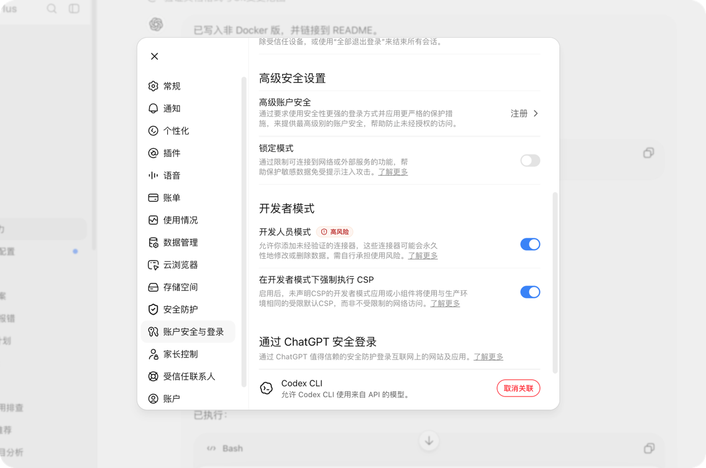
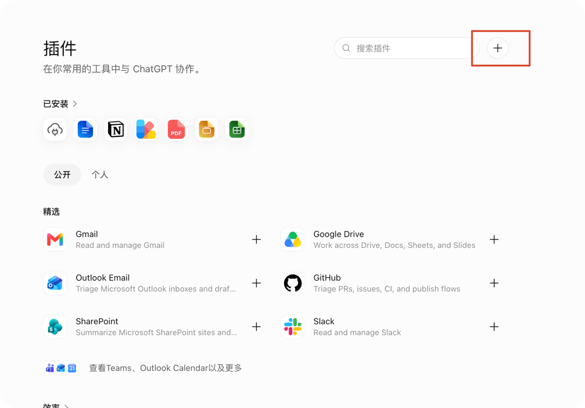
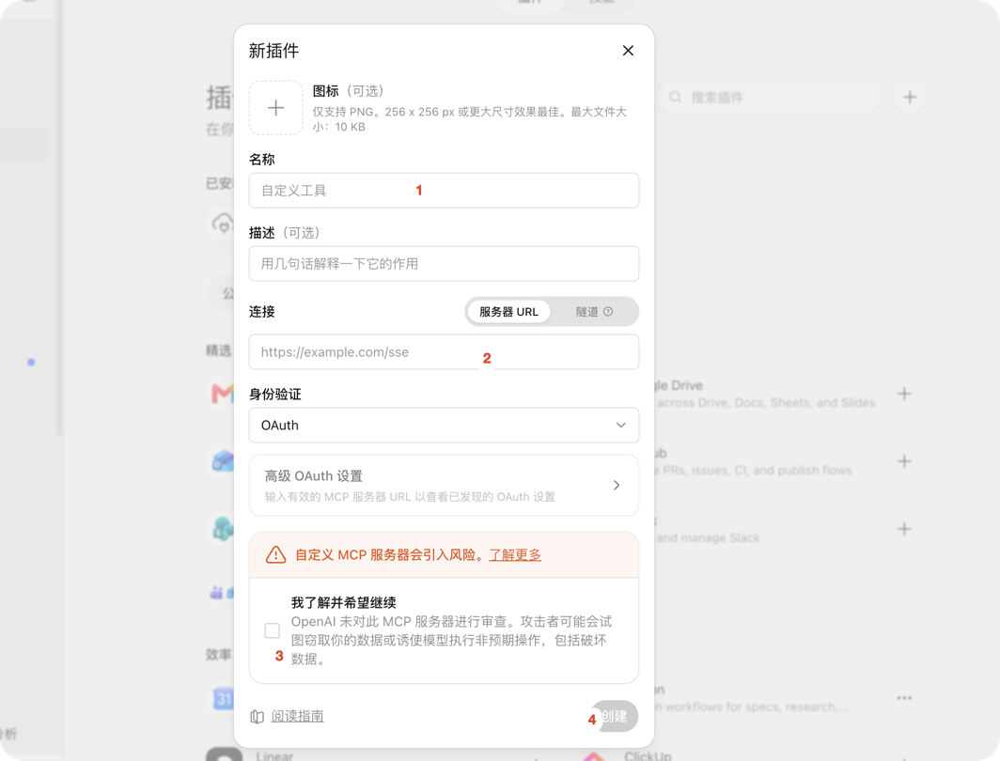

# FRP + Caddy + Docker Compose 部署 MCPX

本文介绍如何把运行在开发机上的 MCPX 安全地接入公网，同时只用 Docker Compose 容器化网络组件：

- 公网 VPS：Docker Compose 运行 **Caddy + frps**。
- 开发机：**MCPX 原生运行**，Docker Compose 只运行 **frpc**。
- MCPX 不放进容器，保留对宿主机 Workspace、工具链、桌面和本地 MCP/Skill 的完整访问能力。

最终公网 MCP 地址示例：

```text
https://mcp.example.com/mcp
```

> 本文示例使用 frp `v0.70.1` 镜像。部署时建议让 frps/frpc 使用相同版本，并在升级前阅读 frp release notes。

## 1. 架构

```text
ChatGPT / Remote MCP Client
            │
            │ HTTPS :443
            ▼
┌─────────────────────────────────────┐
│ 公网 VPS                            │
│                                     │
│ Docker Compose                      │
│                                     │
│  Caddy :80/:443                     │
│      │                              │
│      │ http://frps:19090            │
│      ▼                              │
│  frps :7000                         │
│      │                              │
└──────┼──────────────────────────────┘
       │ FRP tunnel
       │ TLS + token authentication
       ▼
┌─────────────────────────────────────┐
│ 开发机                              │
│                                     │
│ Docker Compose                      │
│   frpc                              │
│      │                              │
│      ▼                              │
│ host.docker.internal:9090           │
│      │                              │
│      ▼                              │
│ MCPX（宿主机原生进程）              │
│ 127.0.0.1:9090/mcp                  │
│      │                              │
│      ├── Workspace                  │
│      ├── Git / Go / Node / Docker  │
│      ├── Local Skills               │
│      └── Upstream MCP               │
└─────────────────────────────────────┘
```

这里有两个重要的安全边界：

1. VPS 的 `19090` **不发布到宿主机公网端口**，只在 Docker Compose 内部网络中供 Caddy 访问。
2. MCPX 继续绑定开发机 `127.0.0.1:9090`，不会直接监听公网网卡。

公网只需要开放：

```text
80/tcp    Caddy HTTP / ACME
443/tcp   Caddy HTTPS
443/udp   可选，HTTP/3
7000/tcp  frpc → frps
```

不需要开放 `19090`。

## 2. 前置条件

假设：

```text
VPS 公网 IP：203.0.113.10
域名：mcp.example.com
FRP 控制端口：7000
FRP MCPX 代理端口：19090
MCPX 本机端口：9090
```

DNS 配置：

```text
mcp.example.com  A  203.0.113.10
```

准备软件：

- VPS：Docker Engine + Docker Compose Plugin。
- 开发机：Docker Desktop（macOS / Windows）或 Docker Engine（Linux）。
- 开发机：已安装并可原生启动 MCPX。

## 3. 开发机配置 MCPX

MCPX 仍然原生运行，不使用 Docker。

全局配置默认位于：

```text
~/.mcpx/config.yaml
```

公网 Remote MCP 推荐使用 OAuth：

```yaml
server:
  host: 127.0.0.1
  port: 9090

  # 请求经过 Caddy + frp 到达本机。
  disable_localhost_protection: true
  trust_proxy_headers: true

auth:
  mode: oauth
  oauth:
    password: "请替换成强随机口令"
    server_url: "https://mcp.example.com"
    token_ttl: 86400

security:
  commands:
    default: confirm

  files:
    max_read_bytes: 1048576
    max_patch_files: 20
    max_patch_lines: 2000

limits:
  max_result_bytes: 262144
```

生成随机 OAuth 口令：

```bash
openssl rand -hex 32
```

注意：

```yaml
oauth:
  server_url: "https://mcp.example.com"
```

这里填写公网 **Origin**，不要追加 `/mcp`。

客户端真正填写的 MCP Endpoint 才是：

```text
https://mcp.example.com/mcp
```

如果尚未注册 Workspace：

```bash
./bin/mcpx workspace register /path/to/your/project
```

启动 MCPX：

```bash
./bin/mcpx
```

确认 MCPX 监听：

```text
127.0.0.1:9090
```

OAuth metadata 可以先在本机测试：

```bash
curl -i http://127.0.0.1:9090/.well-known/oauth-protected-resource
curl -i http://127.0.0.1:9090/.well-known/oauth-authorization-server
```

MCPX 只提供 Streamable HTTP `/mcp`，不要配置旧版 `/sse`。

## 4. VPS：创建 Caddy + frps Compose 项目

在 VPS 创建：

```bash
sudo mkdir -p /opt/mcpx-edge/{caddy,frp,secrets}
cd /opt/mcpx-edge
```

目录结构：

```text
/opt/mcpx-edge/
├── compose.yaml
├── caddy/
│   └── Caddyfile
├── frp/
│   └── frps.toml
└── secrets/
    └── frp-token
```

### 4.1 生成 FRP Token

```bash
openssl rand -hex 32 | sudo tee /opt/mcpx-edge/secrets/frp-token >/dev/null
sudo chmod 600 /opt/mcpx-edge/secrets/frp-token
```

把该 token 安全复制一份到开发机，frpc 必须使用相同 token。

### 4.2 `frps.toml`

创建 `/opt/mcpx-edge/frp/frps.toml`：

```toml
bindAddr = "0.0.0.0"
bindPort = 7000

# 19090 需要让同一个 Compose network 中的 Caddy 容器访问。
# 它不会通过 compose ports 发布到 VPS 公网。
proxyBindAddr = "0.0.0.0"

auth.method = "token"
auth.tokenSource.type = "file"
auth.tokenSource.file.path = "/run/frp/frp-token"

# 限制 frpc 只能申请本教程需要的代理端口。
allowPorts = [
  { single = 19090 }
]

# 只接受启用 TLS 的 frpc 控制连接。
transport.tls.force = true

log.to = "console"
log.level = "info"
```

frp 新版本默认在 frpc → frps 之间启用 TLS；这里在服务端再设置 `transport.tls.force = true`，避免未启用 TLS 的客户端连接。

### 4.3 Caddyfile

创建 `/opt/mcpx-edge/caddy/Caddyfile`：

```caddyfile
mcp.example.com {
    reverse_proxy frps:19090
}
```

不要只代理 `/mcp/*`。

MCPX OAuth 还需要这些地址从公网可达：

```text
/.well-known/oauth-protected-resource
/.well-known/oauth-authorization-server
/mcp
/mcp/oauth/register
/mcp/oauth/authorize
/mcp/oauth/token
```

所以整个 `mcp.example.com` 都交给 MCPX 即可。

### 4.4 `compose.yaml`

创建 `/opt/mcpx-edge/compose.yaml`：

```yaml
services:
  frps:
    image: fatedier/frps:v0.70.1
    restart: unless-stopped
    command: ["-c", "/etc/frp/frps.toml"]
    ports:
      - "7000:7000/tcp"
    expose:
      - "19090"
    volumes:
      - ./frp/frps.toml:/etc/frp/frps.toml:ro
      - ./secrets/frp-token:/run/frp/frp-token:ro
    networks:
      - edge

  caddy:
    image: caddy:2-alpine
    restart: unless-stopped
    depends_on:
      - frps
    ports:
      - "80:80/tcp"
      - "443:443/tcp"
      - "443:443/udp"
    volumes:
      - ./caddy/Caddyfile:/etc/caddy/Caddyfile:ro
      - caddy_data:/data
      - caddy_config:/config
    networks:
      - edge

networks:
  edge:

volumes:
  caddy_data:
  caddy_config:
```

这里故意没有：

```yaml
ports:
  - "19090:19090"
```

因此 `19090` 只存在于 Compose `edge` 网络中，Caddy 可以通过服务名：

```text
frps:19090
```

访问它，但公网无法直接绕过 Caddy 访问 MCPX。

### 4.5 启动 VPS 服务

```bash
cd /opt/mcpx-edge
docker compose pull
docker compose up -d
```

检查：

```bash
docker compose ps
docker compose logs -f frps
docker compose logs -f caddy
```

VPS 防火墙只开放：

```text
80/tcp
443/tcp
443/udp   # 可选
7000/tcp
```

## 5. 开发机：Docker Compose 运行 frpc

开发机目录示例：

```bash
mkdir -p ~/.config/mcpx-frpc/{frp,secrets}
cd ~/.config/mcpx-frpc
```

结构：

```text
~/.config/mcpx-frpc/
├── compose.yaml
├── frp/
│   └── frpc.toml
└── secrets/
    └── frp-token
```

把 VPS 的 FRP token 写到：

```text
~/.config/mcpx-frpc/secrets/frp-token
```

并限制权限：

```bash
chmod 600 ~/.config/mcpx-frpc/secrets/frp-token
```

## 6. macOS / Windows Docker Desktop 配置

Docker Desktop 提供 `host.docker.internal`，容器可以通过它访问宿主机服务。

创建 `frp/frpc.toml`：

```toml
serverAddr = "203.0.113.10"
serverPort = 7000

auth.method = "token"
auth.tokenSource.type = "file"
auth.tokenSource.file.path = "/run/frp/frp-token"

# 新版 frpc 默认启用 TLS；显式写出便于审计。
transport.tls.enable = true

[[proxies]]
name = "mcpx"
type = "tcp"

# MCPX 是宿主机原生进程，不是 Compose service。
localIP = "host.docker.internal"
localPort = 9090
remotePort = 19090
```

创建 `compose.yaml`：

```yaml
services:
  frpc:
    image: fatedier/frpc:v0.70.1
    restart: unless-stopped
    command: ["-c", "/etc/frp/frpc.toml"]
    volumes:
      - ./frp/frpc.toml:/etc/frp/frpc.toml:ro
      - ./secrets/frp-token:/run/frp/frp-token:ro
```

启动：

```bash
docker compose pull
docker compose up -d
docker compose logs -f frpc
```

## 7. Linux 开发机配置

Linux 上如果 MCPX 严格绑定 `127.0.0.1:9090`，最稳妥的方式是让 **frpc 容器使用 host network**，这样容器里的 `127.0.0.1` 就是宿主机网络命名空间。

`frp/frpc.toml`：

```toml
serverAddr = "203.0.113.10"
serverPort = 7000

auth.method = "token"
auth.tokenSource.type = "file"
auth.tokenSource.file.path = "/run/frp/frp-token"
transport.tls.enable = true

[[proxies]]
name = "mcpx"
type = "tcp"
localIP = "127.0.0.1"
localPort = 9090
remotePort = 19090
```

Linux 的 `compose.yaml`：

```yaml
services:
  frpc:
    image: fatedier/frpc:v0.70.1
    restart: unless-stopped
    network_mode: host
    command: ["-c", "/etc/frp/frpc.toml"]
    volumes:
      - ./frp/frpc.toml:/etc/frp/frpc.toml:ro
      - ./secrets/frp-token:/run/frp/frp-token:ro
```

不建议为了让 bridge 容器访问 MCPX 而把 MCPX 改成 `0.0.0.0:9090`。

## 8. 分层验证

建议严格按下面顺序排错。

### 8.1 MCPX 本机

开发机：

```bash
curl -i http://127.0.0.1:9090/.well-known/oauth-protected-resource
```

这一步失败时先修 MCPX，不要检查 FRP/Caddy。

### 8.2 frpc → frps

开发机：

```bash
docker compose logs frpc
```

应该能看到成功登录 frps、`mcpx` proxy 启动成功。

VPS：

```bash
cd /opt/mcpx-edge
docker compose logs frps
```

应该能看到对应 frpc 登录和 `mcpx` TCP proxy。

### 8.3 Caddy → frps → frpc → MCPX

公网或 VPS：

```bash
curl -i https://mcp.example.com/.well-known/oauth-protected-resource
curl -i https://mcp.example.com/.well-known/oauth-authorization-server
```

最终 MCP Endpoint：

```text
https://mcp.example.com/mcp
```

不要用裸 `GET /mcp` 是否返回 200 来判断 MCP 是否正常；完整验证应由支持 Streamable HTTP 的 MCP Client 发起 `initialize`。

## 9. OpenAI / ChatGPT 配置

OpenAI 产品界面会持续更新

当前 ChatGPT 自定义 MCP App 的典型流程是：启用 Developer Mode，进入 Apps 创建自定义 App，填写远程 MCP Endpoint 和认证方式，完成 OAuth，然后 Scan Tools / 创建 App。





本文部署的 Endpoint：

```text
https://mcp.example.com/mcp
```

认证方式：

```text
OAuth
```

## 10. Bearer 模式

如果客户端支持自行携带 Bearer Header，也可以不用 OAuth。

MCPX：

```yaml
server:
  host: 127.0.0.1
  port: 9090
  disable_localhost_protection: true
  trust_proxy_headers: true

auth:
  mode: bearer
  token: "请替换成强随机 token"
```

生成 token：

```bash
openssl rand -hex 32
```

公网地址仍然是：

```text
https://mcp.example.com/mcp
```

FRP 和 Caddy 不需要修改。

## 11. 常见问题

### Caddy 返回 502

按顺序检查：

```bash
# VPS
docker compose ps
docker compose logs frps
docker compose logs caddy
```

然后检查开发机：

```bash
docker compose logs frpc
curl -i http://127.0.0.1:9090/.well-known/oauth-protected-resource
```

### frpc 能登录，但 proxy 连不上 MCPX

macOS / Windows：确认 `localIP` 是：

```toml
localIP = "host.docker.internal"
```

Linux：推荐使用：

```yaml
network_mode: host
```

并配置：

```toml
localIP = "127.0.0.1"
```

### OAuth URL 变成 http 或内部地址

检查 MCPX：

```yaml
server:
  trust_proxy_headers: true

auth:
  oauth:
    server_url: "https://mcp.example.com"
```

并确认 Caddy 是最终公网 HTTPS 入口。

### `/sse` 返回 404

这是预期行为。MCPX 只提供：

```text
/mcp
```

不要使用旧 HTTP+SSE endpoint。

### 公网能直接访问 `:19090`

这不是本文期望的状态。

检查 VPS `compose.yaml`，`frps` 只能：

```yaml
expose:
  - "19090"
```

不能出现：

```yaml
ports:
  - "19090:19090"
```

同时检查云安全组/防火墙，没有必要开放 TCP 19090。

## 12. 安全检查清单

上线前至少确认：

- MCPX 仍绑定 `127.0.0.1:9090`。
- MCPX 公网模式使用 `oauth`、`bearer` 或 `dual`，不是 `open`。
- `security.commands.default` 保持 `confirm` 或更严格策略。
- FRP Token 使用随机值并通过只读文件挂载，不直接提交到 Git。
- frps 设置 `allowPorts`，只允许 `19090`。
- frps 强制 TLS，frpc 启用 TLS。
- VPS 不对公网发布 `19090`。
- Caddy 是唯一公网 MCP HTTP/HTTPS 入口。
- DNS 只指向自己的 VPS。
- OpenAI 配置截图发布前检查是否含用户名、OAuth 密码、Token、Cookie 或敏感 Workspace 信息。

## 13. 启停命令速查

VPS：

```bash
cd /opt/mcpx-edge
docker compose up -d
docker compose ps
docker compose logs -f
docker compose restart frps
docker compose restart caddy
docker compose down
```

开发机：

```bash
cd ~/.config/mcpx-frpc
docker compose up -d
docker compose ps
docker compose logs -f frpc
docker compose restart frpc
docker compose down
```

MCPX 仍按原生方式启动和升级，与 FRP/Caddy Compose 生命周期完全解耦。
